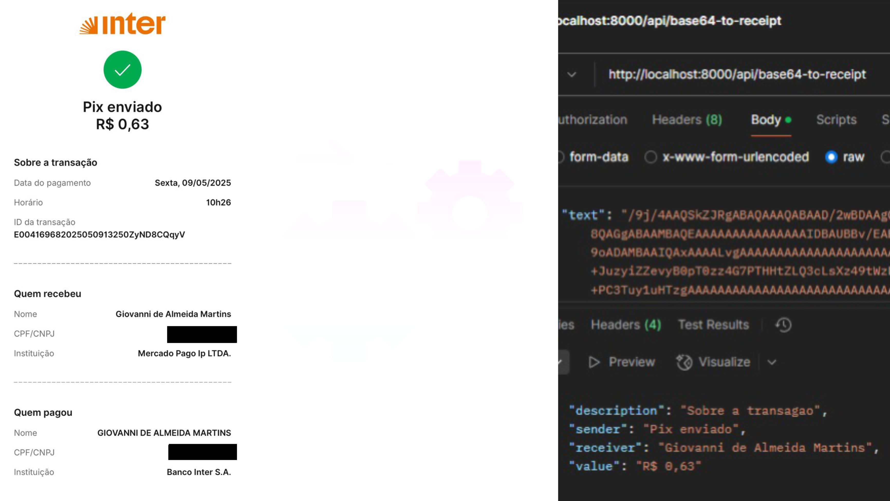

# Receipt Processing Service

A service that extracts structured information from receipt images using OCR and language models.

## Overview

This service provides a REST API that processes receipt images (provided as base64-encoded strings) and extracts key information such as sender, receiver, amount, and transaction description. It combines OCR technology with advanced language models to deliver accurate data extraction.

## Example image



## Features

- **Base64 Image Processing**: Convert base64-encoded receipt images to structured data
- **Information Extraction**: Extract sender, receiver, amount, and transaction description
- **REST API**: Simple API endpoints for integration with other services
- **Docker Support**: Easy deployment using Docker and Docker Compose
- **Memory Optimization**: Smart text truncation and GPU/CPU processing options

## Installation

### Prerequisites

- Docker and Docker Compose
- Python 3.11+ (for local development)
- Hugging Face account and API token

### Using Docker (Recommended)

1. Clone the repository:
   ```bash
   git clone <repository-url>
   cd base64receipt-to-entity
   ```

2. Create [`.env`](.env ) file from the template:
   ```bash
   cp .env.template .env
   ```

3. Edit the [`.env`](.env ) file and add your Hugging Face token:
   ```
   HF_TOKEN=your_huggingface_token_here
   ```

4. Build and start the service:
   ```bash
   make build
   make start
   ```

### Local Development Setup

1. Install dependencies:
   ```bash
   pip install -r requirements.txt
   ```

2. Setup environment variables:
   ```bash
   cp .env.template .env
   # Edit .env with your configuration
   ```

3. Run the service:
   ```bash
   uvicorn src.api:app --reload
   ```

## API Usage

### Health Check

```bash
curl -X GET http://localhost:8000/api/ping
```

### Process Receipt Image

```bash
curl -X POST http://localhost:8000/api/base64-to-receipt \
  -H "Content-Type: application/json" \
  -d '{"text": "base64_encoded_image_string"}'
```

### Sample Response

```json
{
  "description": "Payment for services",
  "sender": "John Doe",
  "receiver": "ACME Corp",
  "value": "R$ 150,00"
}
```

## Architecture

The service is built with the following components:

- **FastAPI**: Web framework for building the API
- **Tesseract OCR**: Optical character recognition for extracting text from images
- **Hugging Face Transformers**: Language models for text processing and information extraction
- **PyTorch**: Deep learning framework that powers the language models

## Configuration

Configuration is managed through environment variables:

| Variable | Description | Default |
|----------|-------------|---------|
| `MODEL_NAME` | Hugging Face model to use | google/gemma-3-1b-it |
| `DEVICE` | Device to run the model on (auto, cuda, cpu) | auto |
| `API_HOST` | Host for the API server | 0.0.0.0 |
| `API_PORT` | Port for the API server | 8000 |
| `HF_TOKEN` | Hugging Face API token | - |

See [`.env.template`](.env.template ) for more configuration options.

## Development

For more detailed development information, see Developer Guide.

### Available Make Commands

The project includes a Makefile with useful commands:

```bash
make help     # Show available commands
make start    # Start the service
make stop     # Stop the service
make logs     # View logs
make build    # Build the Docker image
make clean    # Clean up Docker resources
make install  # Install Python dependencies
make test     # Run tests
```

## License

This project is licensed under the MIT License.